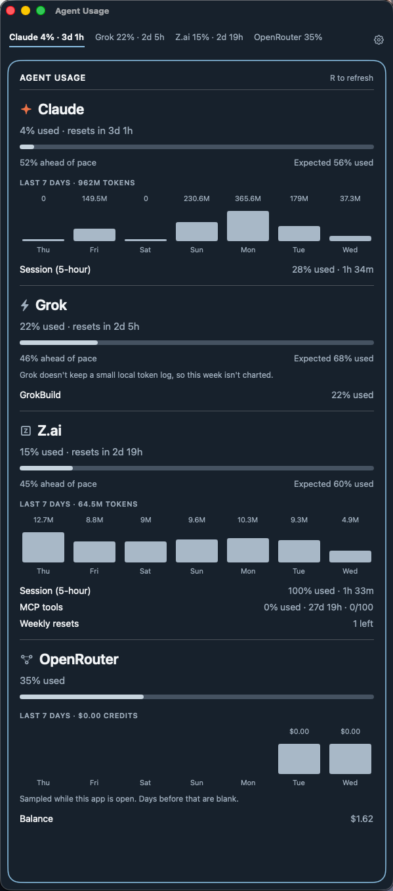

# Agent Usage

Agent Usage is a Mac menu bar app that shows how much of your AI coding quota you have used. It covers Claude, Codex, Z.ai, OpenRouter, and Grok. A terminal command prints the same numbers.





## What you need

macOS 14 or later, and Swift 6. A current Xcode install includes Swift. There is no downloaded installer. You build the app from this folder.

## Build and open

From this folder:

```sh
./scripts/build-app.sh
open AgentUsage.app
```

That compiles a release build, wraps it as `AgentUsage.app`, and signs it so your Mac will open it. The app stays out of the Dock. Find it in the menu bar. Before the first numbers arrive, the label says Usage. After that it shows a short reading for each account you have turned on, such as `Claude 31% · Router $4.50`.

To open a regular window instead of the menu bar panel:

```sh
swift run AgentUsage --window
```

## Sign in

Each card uses the login already saved by that tool.

| Account | Do this first |
| --- | --- |
| Claude | Run `claude` and sign in. The first time this app reads the keychain, macOS asks you to allow it. |
| Codex | Run `codex login` |
| Grok | Run `grok login` |
| Z.ai | Add a Z.ai key in ZCode or OpenCode |
| OpenRouter | Add an OpenRouter key in OpenCode or Kilo |

A signed-out card repeats that instruction. If the terminal command says the keychain is locked, open the app once, allow access, and run the command again.

## The panel

Click the menu bar item. The names across the top are your accounts. Click one to jump to its card, or drag a name to change the order. The menu bar follows that order.

The top line of a card is the longest limit, usually the weekly one: percent used, and how long until it resets. Under the bar, a pace line compares your usage with a steady burn. Halfway through the week at 30% used means you are ahead of pace. Shorter limits, per-model caps, and leftover balances are listed below that.

Claude and Codex chart the last 7 days from logs those tools already keep on your Mac. Z.ai charts the last 7 days from its usage API when that data is available. OpenRouter fills a day only while this app is open, so earlier days stay blank. Grok has no week chart.

Press R, or click "R to refresh", to fetch again. The app also refreshes about once a minute. When a fetch fails, the last good numbers stay on the card, with a note of how long ago they were updated.

## Settings

The gear at the top of the panel opens Settings.

- Turn an account off when you do not use it. With every account off, the panel asks you to turn one on.
- Move accounts up or down. The panel and the menu bar both use that order.
- "Show usage in the menu bar" hides the percentages and leaves a chart icon.
- "Launch at login" starts the menu bar app when you log in to the Mac.

## Terminal

From this folder:

```sh
swift run agent-usage
```

You get one line per account. Add `--json` for the full reading, including reset times. The command exits with status 1 when every account is signed out or failed.

## License

MIT. Copyright 2026 Eri Bastos.
